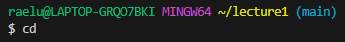
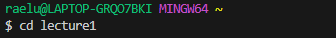
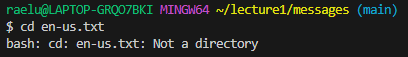
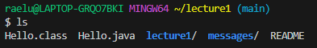
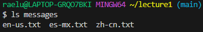
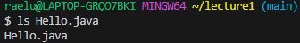

```
C:\Users\raelu\lecture1\lecture1
``` 
  

```
C:\Users\raelu\lecture1\lecture1
``` 
  

  

```
C:\Users\raelu\lecture1\lecture1
``` 
  

```
C:\Users\raelu\lecture1\lecture1
``` 
  

 ```
C:\Users\raelu\lecture1\Hello.java
```  
  

  
  
  
