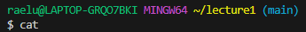

```
C:\Users\raelu\lecture1
``` 
  
>The directory is moved back by 1 directory, so the working directory went from ```C:\Users\raelu\lecture1``` to ```C:\Users\raelu```.
  ***
  
```
C:\Users\raelu
``` 
  
>The directory moved into the specified directory, so this time the working directory went from ```C:\Users\raelu``` to ```C:\Users\raelu\lecture1```.
  ***
  
```
C:\Users\raelu\lecture1\messages
```
  
>There was an error because ```cd``` moves directories, but ```Hello.java``` is not a directory, it is a file.
  ***
  
```
C:\Users\raelu\lecture1
``` 
  
>A list of the current directory is printed with whatever is in it.
  ***
  
```
C:\Users\raelu\lecture1
``` 
  
>A list of whatever is inside the specificed directory is printed.
  ***
  
```
C:\Users\raelu\lecture1
```  
  
>The name of the specified file is repeated.  
  ***  
  
```
C:\Users\raelu\lecture1
```  
  
>Anything written after ```cat``` on its own is repeated. To quit the command, CTRL+D.
  ***
  
```
C:\Users\raelu\lecture1
```  
   
>A statement is printed, letting the user know that the directory specified is a directory.
  ***
  
```
C:\Users\raelu\lecture1
```  
  
>Anything inside the specified file is printed.
