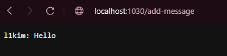
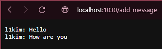
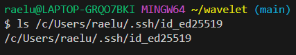

>ChatServer code

```
import java.io.IOException;
import java.net.URI;

class Handler implements URLHandler {
    //string represets a chat message
    private String messages = "";

    public String handleRequest(URI url) {
        if (url.getPath().equals("/add-message")) {
            String[] parameters = url.getQuery().split("&");

            String message = "";
            String user = "";

            for (String param: parameters){
                String[] keyValue = param.split("=");
                if (keyValue[0].equals("s")){
                    message = keyValue[1];
                }
                else if (keyValue[0].equals("user")){
                    user = keyValue[1];
                }
            }

            if (!message.isEmpty() && !user.isEmpty()){
                messages += user + ": " + message + "\n";
            }

            return messages;
        }
        else {
            return "Chat empty";
        }
    }
}

class ChatServer {
    public static void main(String[] args) throws IOException {
        if(args.length == 0){
            System.out.println("Missing port number! Try any number between 1024 to 49151");
            return;
        }

        int port = Integer.parseInt(args[0]);

        Server.start(port, new Handler());
    }
}
```  
  
>Using `http://localhost:1030/add-message?s=Hello&user=l1kim`, I added a message.
>`/add-message` is called. It takes in a string for the message, and another string for the username.  
>The value of `message` and `user` is updated to concatenate into `messages`.  
>Then, the value of `messages` is updated with the new message, along with and indication of the user who wrote it.  
  
  

    
>Using `http://localhost:1030/add-message?s=How are you&user=l1kim`, I added a message.
>`/add-message` is called. It takes in a string for the message, and another string for the username.  
>The value of `message` and `user` is updated to concatenate into `messages`.  
>Then, the value of `messages` is updated with the new message, along with and indication of the user who wrote it.  
>The screen will display the new message, as well as all previous messages, because all the user messages are stored into one variable `messages`.  
  
  


 
