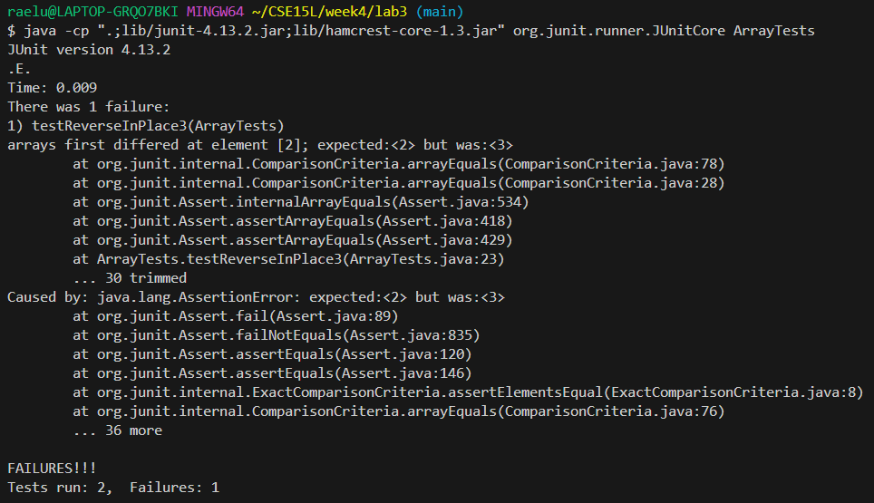

I chose the testReverseInPlace method bug.

This is a failure inducing input:  
```
  @Test 
	public void testReverseInPlace3() {
    int[] input1 = { 1,2,3,4 };
    ArrayExamples.reverseInPlace(input1);
    assertArrayEquals(new int[]{ 4,3,2,1 }, input1);
	}
```  
This is a non-failure inducing input:  
```
	@Test 
	public void testReverseInPlace() {
    int[] input1 = { 3 };
    ArrayExamples.reverseInPlace(input1);
    assertArrayEquals(new int[]{ 3 }, input1);
	}
```


