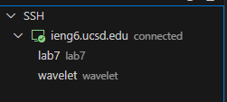
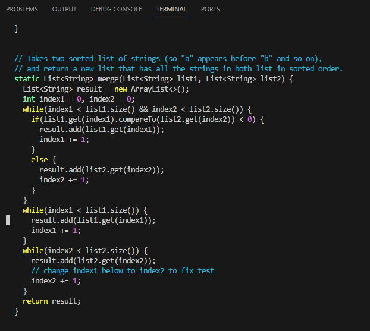
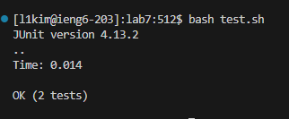
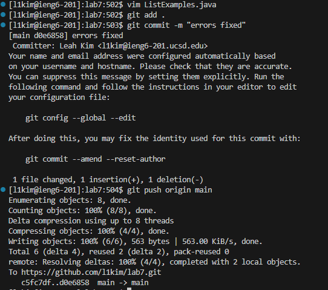

  
```
I clicked on the ieng6.ucsd.edu ssh remote login in my VSCode remote explorer tab.
This logged me into my remote ssh.
```

.png)  
.png)  
```
Keys pressed: git<space>clone<space><Ctrl v><enter>
My ssh repository was in my clipboard as git@github.com:l1kim/lab7.git.
I was able to clone my forked repository into my ssh.
```

.png)
```
Keys pressed: <Ctrl v><enter><Ctrl v><enter>
bash<space>test.sh<enter>

The compile command was in my clipboard the first paste, then the run command was in my clipboard the second paste.
I compiled my tests and ran them, which showed that the tests failed.
```


```
I clicked on line 44 of my ListExamples.java file next to index 1.
Keys pressed: <insert><insert>2<esc>:wq<enter>
This made the correct index update to its correctly corresponding list. Then I saved the changes and quit vim.
```


```
Keys pressed: <up><up><up><enter>
<up><up><up><up><enter>

The compile command was 3 up in the history, and my bash command was 4 up in the history.
I compiled and ran my tests again, this time they were successful.
```


```
Keys pressed: git<space>add<space>.<enter>g
it<space>commit<space>-m<space>"commit"<enter>
git<space>push<space>origin<space>main<enter>

The first command adds the changes to the staging area.
The next command saves a snapshot of the changes.
The last command allows the changes to appeat on GitHub.
```
