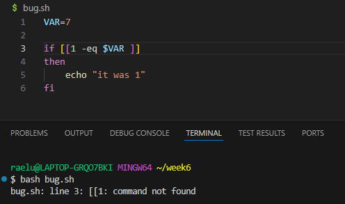
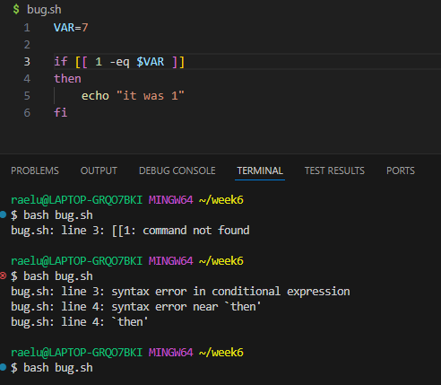

Student:  
Hello, I was wondering what's wrong with my code? It keeps saying the command is not found for some reason, and I have no idea why.  
I'm sure I wrote the code right, but I don't know why there is an issue.  
  
  
  
TA:  
Hi there! Let's start by looking at what exactly the error says.  
It tells you where in the code there seems to be a problem.  
Maybe you could google some bash code and images to give you a sense of what might be going on.  
Take a close look around the line of code where the issue persists!  
  
  
Student:  
Hi again! I figured out what's wrong with my code.  
I thought that maybe something was wrong somewhere in the line that was giving the error.
I kept trying to change the line that was wrong and it seemed like there was a syntax error!  
Once I changed enough things, I figured out the correct syntax for the line.  
  


File/Directory structure: Just one bash file with code inside.  
Contents before fixing bug: 
```
VAR=7

if [[1 -eq $VAR ]]
then
    echo "it was 1"
fi
```
Trigger the bug: `bash bug.sh`
What to edit: The syntax of the `if` line. There needs to be a space between the `[[` and `1`.
